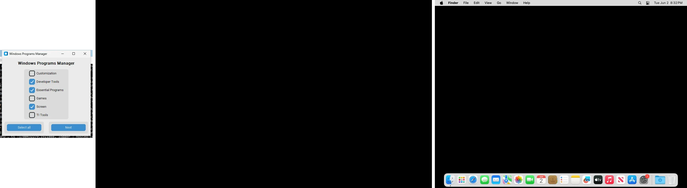
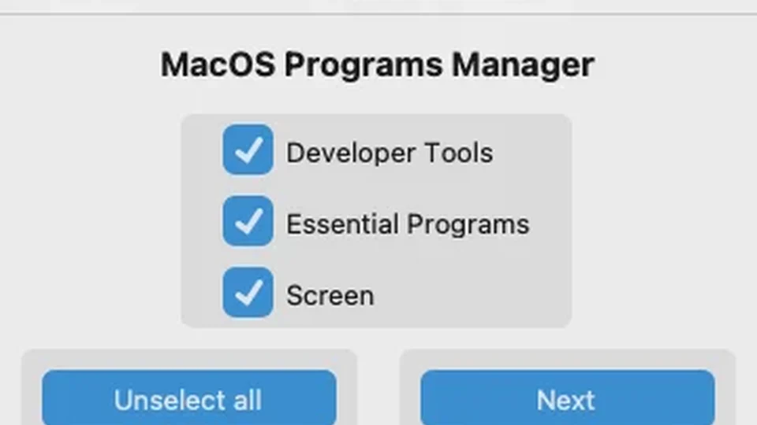

# Auto Installation Programs

Programs Manager is a cross-platform installer and startup manager. The Windows build includes installer categories plus custom actions such as startup management and system customization.

## More information

- [macOS](#macos)
- [Linux](#linux)
- [Windows](#windows)

## Interface



## Packaging

The project is packaged with PyInstaller using `build.bat` on Windows, `build.sh` on Linux, and `build-mac.sh` on macOS. Both `src` and `install` are bundled into the executable so runtime configuration and Windows assets remain available.

Runtime data written locally:

- `programs.log` — registry startup dump produced by the startup manager actions.
- `log.log` — shared runtime log exposed to the background log bridge.

## One-line run (no manual download)

Run directly from the terminal without cloning the repository. The script fetches/updates source code into a local cache and launches the app.

Windows PowerShell:

```powershell
irm https://raw.githubusercontent.com/JLBBARCO/programs-manager/main/run.ps1 | iex
```

Linux:

```bash
curl -fsSL https://raw.githubusercontent.com/JLBBARCO/programs-manager/main/run.sh | bash
```

macOS:

```bash
curl -fsSL https://raw.githubusercontent.com/JLBBARCO/programs-manager/main/run.sh | bash
```

Optional branch override (useful for testing `develop`):

```powershell
$env:AIP_BRANCH='develop'; irm https://raw.githubusercontent.com/JLBBARCO/programs-manager/main/run.ps1 | iex
```

```bash
AIP_BRANCH=develop curl -fsSL https://raw.githubusercontent.com/JLBBARCO/programs-manager/main/run.sh | bash
```

## Current scope

The Windows flow currently exposes these actions:

- Disable startup entries that are not listed in the repository whitelist.
- Re-enable startup entries listed in the repository whitelist.
- Install categories from the Windows JSON files, including custom `function` entries.
- Apply the Vision Cursor Black fallback from `install/windows/vision-cursor-black` when the function is selected.
- Run uninstall selections before install selections in the same execution flow.
- Support Windows category entries that use either `id` or `function`, including `ti_tools.json`.

Startup resources (category JSON files, whitelist, Office deployment files) are downloaded from the repository at runtime when needed.

## Configuration (JSON schema)

Category files in `install/windows/*.json` follow a simple schema. Each file contains a top-level `programs` array with entries that use one of two keys to define an action:

- `id` — package identifier used by the system package manager (e.g., `winget`, `brew`, `apt`). When present, the installer uses the package manager to install the program.
- `function` — a repository-defined custom action. The installer dispatches these to internal handlers instead of a package manager.

Example entries:

```json
{ "name": "Rufus", "id": "Rufus.Rufus" }
{ "name": "Dark Mode", "function": "dark-mode" }
{ "name": "BIOS", "function": "path-to-bios" }
```

Behavior notes:

- If an entry provides both `id` and `function`, `function` will take precedence and the custom handler will run.
- Supported built-in `function` keys include `dark-mode`, `path-to-bios`, and `vision-cursor`. Custom handlers are implemented in `lib.install._run_custom_function` and `lib.customizations`.
- The GUI and `install` module accept either store `id` values or `function` keys and will present entries accordingly.

## Build and CI

The main build workflow runs on Python 3.12 and is configured for the `main` and `develop` branches. It triggers when Python files, install data, workflow files, the README, `requirements.txt`, or platform build scripts change. Pushes to `develop` publish GitHub pre-releases; pushes to `main` publish regular releases.

The macOS installer workflow uses Python 3.12 and creates a package with `pkgbuild` after the app bundle is produced.

On each successful platform build, the CI workflow launches the compiled app, captures a screenshot for Windows, Linux, and macOS, updates `src/assets/img/windows.webp`, `src/assets/img/linux.webp`, `src/assets/img/macos.webp`, and rebuilds `src/assets/img/thumbnail.webp` from those three images.

## macOS

The macOS section is organized around these areas:

- Developer Tools
- Essential Programs
- Screen



### Essential programs

- Adobe Acrobat
- Cloudflare Warp
- Free Download Manager
- Google Chrome
- Google Drive
- Mozilla Firefox
- Spotify
- Telegram
- The Unarchiver
- VLC
- WhatsApp

### Screen

- AnyDesk

### Developer Tools

- Blender
- Docker
- Figma
- GIMP
- GitHub
- Microsoft Teams
- MySQL Workbench
- VirtualBox
- Visual Studio Code
- XAMPP

## Linux

The Linux section is organized around these areas:

- Developer Tools
- Drivers
- Essential Programs
- Server Tools
- Screen


### Drivers

The system analyzes the graphics card and installs the appropriate drivers.

- AMD
- Intel
- NVIDIA

### Essential programs

- Curl
- Free Download Manager
- Git
- Google Chrome
- Mozilla Firefox
- Spotify
- Telegram
- VLC
- WhatsApp

### Screen

- AnyDesk
- Git
- VNC Server

### Developer Tools

- Arduino IDE
- Blender
- Docker
- GIMP
- Git
- Node.js
- Python 3
- VirtualBox
- Visual Studio Code

### Server Tools

- Curl & Wget
- Git
- htop
- net-tools
- SSH server
- Vim

## Windows

The Windows app combines startup management, install categories, and system customization.


### Behavior

- Disable startup entries that are not on the repository whitelist.
- Re-enable startup entries that are on the repository whitelist.
- Save the current registry startup dump to `programs.log` after each action.
- Run uninstall selections before install selections when both are chosen.
- Support JSON entries that use either `id` or `function`.
- Open the shared log bridge for the runtime site when the app starts a run session.

### Safety

- The whitelist is downloaded from the repository and cached locally at runtime.
- Matching is normalized and exact; broad substring matches were removed to avoid false positives.
- Theme, mouse precision, power plan, Explorer restarts, and other deprecated Windows-only actions are kept isolated behind explicit functions.

### Whitelist

Allowed startup keys are defined in `install/windows/white_list.txt` in the repository.

Use `install/windows/list_startup_programs.py` to inspect the registry names present on your machine and adjust the whitelist if needed.
