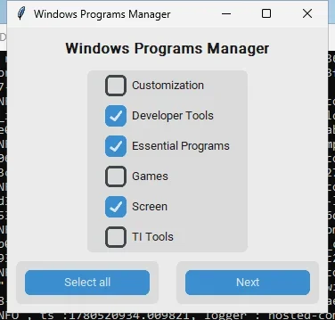

# Windows

The current Windows app is restricted to startup management.

## Behavior

- Disable startup entries that are not on the local whitelist.
- Re-enable startup entries that are on the local whitelist.
- Save the current registry startup dump to `programs.log` after each action.

## Safety Changes

- The whitelist is loaded only from the local repository copy.
- Matching is normalized and exact; broad substring matches were removed.
- Theme, mouse precision, power plan, Explorer restarts, and installer execution were removed from the Windows flow.

## Whitelist

Allowed startup keys are defined in `install/windows/white_list.txt`.

Use `install/windows/list_startup_programs.py` to inspect the registry names present on your machine and adjust the whitelist if needed.
